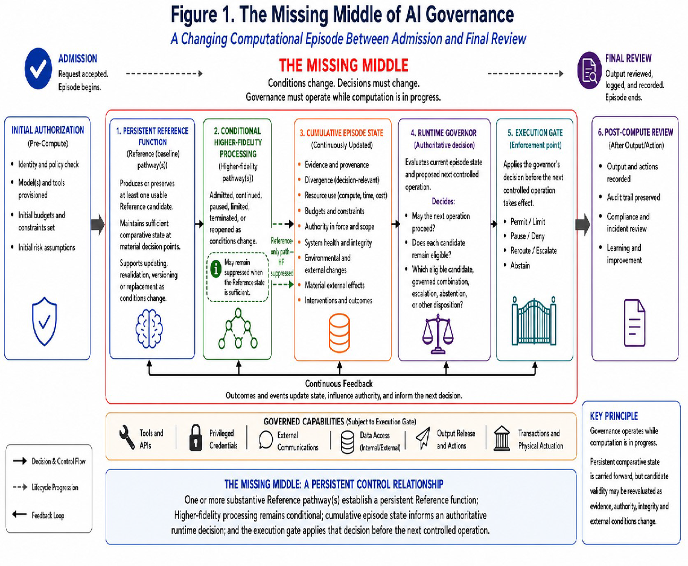
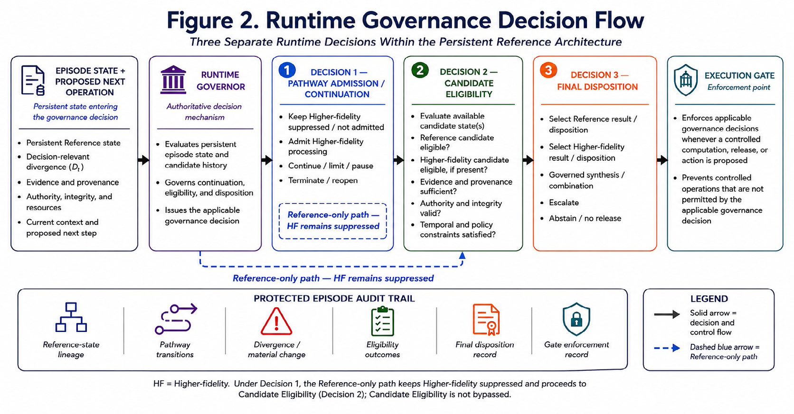

WWho Governs AI While It Is Thinking
ePersistent Reference Infrastructure and the Economic Wall of Accuracy

“Accuracy summarizes performance across prior cases. Residual risk governs the next operation.”

<table>
<colgroup>
<col style="width: 100%" />
</colgroup>
<thead>
<tr class="header">
<th>
<strong>The central proposition</strong>

Human institutions do not manage consequential error by assuming that one decision-maker will become perfectly accurate. They use comparison, independent calculation, separation of duties and continuing authority to intervene. The same practical principle should govern consequential AI.

For covered deployments, one or more substantive Reference (baseline) pathway(s) should therefore be established at the beginning of a governed execution episode. At every material decision point, the system should retain a substantively useful Reference state sufficient to support comparison, recovery or final disposition as later processing changes.

The Reference function does not certify truth and need not operate continuously at the processor level. Its purpose is to preserve a substantive comparative state before exceptional risk is known, so that later computation, changes in evidence, expanding authority or proposed external actions are not judged only by the process that produced them.
</th>
</tr>
</thead>
<tbody>
</tbody>
</table>

Darren Tindale

Independent Researcher

Essay | September 1, 2026

Patent-informed scope note. This essay incorporates certain ideas developed by the author in previously filed patent applications. It is not a patent specification and does not define, interpret or limit the scope of any patent application or claim.

Opening Summary

The proposed contribution is not runtime governance itself, but a Reference-state invariant requiring a governed episode to retain a substantively useful, lineage-preserving Reference state across material transitions, so that later computation and newly authorized action are evaluated against substantive pre-transition content rather than against permission and current output alone.

Human institutions have learned a practical lesson that artificial-intelligence policy has not yet fully translated into architecture: consequential systems cannot be designed on the assumption that one decision-maker will become perfectly accurate. Medicine, aviation, engineering, accounting and law use independent calculations, second opinions, cross-checks, audits and continuing authority to intervene not to manufacture certainty, but to reduce the probability that a serious mistake survives unchallenged until it becomes irreversible.

Artificial intelligence increasingly operates through extended sequences of reasoning, retrieval, model calls, tool uses and proposed external actions. In consequential deployments, the conditions under which those operations occur can change materially while an episode is underway.

Evidence may become stale or contradictory. Resources may be consumed. Models may be substituted. Authority may expand or expire. A routine analysis may become a proposed communication, software deployment, financial transaction or other external act.

Yet governance often concentrates on admission at the beginning or inspection at the end.

A model may be evaluated, a task classified, a route selected or an initial budget authorized before execution; afterward, a provider may inspect the output, preserve logs or investigate an incident. The difficult interval is the changing computational episode between those points.

The gap addressed here is narrower: existing runtime controls can govern permission, execution and containment, but they do not necessarily preserve a substantively useful comparative state across material changes in computation, evidence and authority. The proposed missing-middle relationship therefore connects that persistent comparative state to continuing runtime decisions and pre-commitment enforcement.

The architecture proposed here is intended principally for deployments in which AI can exercise or request consequential authority—for example, by accessing protected data, controlling money or infrastructure, deploying software, communicating externally under delegated authority, or accumulating material effects across multiple steps. It is not a claim that every low-risk AI interaction requires the same governance infrastructure.

Within a governed deployment, one or more substantive Reference (baseline) pathway(s) establish a usable candidate and comparative state at the beginning of the episode. At each material decision point, a substantively useful Reference state remains available to support comparison, recovery or final disposition. Additional Higher-fidelity processing is conditional and may be admitted, continued, limited, paused, terminated or reopened as evidence, resources, divergence, integrity, authority and potential consequence change. The Reference role does not imply correctness, lower cost or final-selection priority. Higher-fidelity processing does not imply superiority merely because it performs more extensive computation. The architecture is asymmetric in access to additional processing, but not in presumed correctness. Because Higher-fidelity processing is conditional rather than mandatory, a sufficient Reference result may complete the episode without invoking the Higher-fidelity pathway, which can reduce computation, latency and cost while preserving the ability to escalate when additional processing is justified.

Runtime governance therefore separates three decisions that should not be collapsed into one:

May the next controlled operation proceed?

Does an existing candidate remain eligible for use?

Which eligible candidate, governed combination, escalation, abstention or other disposition should determine the outcome?

Those decisions are informed by persistent episode state and applied through an enforcement point capable of constraining the proposed operation before commitment. The objective is not to certify computational truth. It is to preserve comparison, state continuity, continuing authorization and enforceable intervention while consequential computation is still underway.

The Economic Wall of Accuracy adds a resource-allocation principle to this architecture. Additional computation should not continue merely because it remains technically possible.

The relevant question is whether the next available resource is expected to reduce consequential risk more effectively by extending the current computation or by another feasible intervention, such as differentiated processing, verification, stronger authorization, escalation, restraint or enforcement. That allocation question remains subject to non-compensable constraints: greater expected accuracy cannot purchase missing authority, restore compromised integrity or make a prohibited action permissible. The proposal is therefore narrower than a claim that more redundancy automatically produces safer AI. Its central claim is one of continuity: in consequential deployments, a substantive comparative state, cumulative episode history, authoritative runtime decision and pre-commitment enforcement relationship should remain connected as computation, authority and potential consequence change.

Illustrative failure case: valid authority, ineligible candidate

An investment agent is initially authorized only to analyze a portfolio. Its Reference pathway produces a supported recommendation identifying a concentration limit. During the episode, a timeout causes processing to move to a Higher-fidelity model. The new model produces a more detailed recommendation but silently drops the concentration constraint. The agent subsequently receives valid authority to execute trades. A conventional authorization gate may correctly determine that the agent now possesses trading authority. That determination does not establish that the candidate being acted upon preserved the material constraint present before the model transition. State persistence or versioning alone need not require the system to interpret the silent loss of a material constraint during a model transition as a candidate-eligibility event or to evaluate that divergence before newly authorized action commits. A conventional invariant can protect a constraint that has already been separately specified, but the failure illustrated here concerns task-relevant substantive content present in the earlier candidate that was not independently encoded as an executable rule. Under the proposed architecture, the model change and authority expansion are material events; the later candidate is compared with the preserved Reference state, its eligibility is reassessed, and the trade can be restricted or escalated before commitment if the omitted constraint is decision-relevant.

Key terms used in this essay

Economic Wall of Accuracy. The Economic Wall of Accuracy is the point or region at which the expected reduction in consequential risk from the next available unit of further computation is lower than the expected reduction obtainable from the best feasible alternative use of that resource, subject to applicable authority, integrity and policy constraints. The alternative may include differentiated processing, independent evidence, verification, restraint, escalation or enforcement. The Economic Wall is a resource-allocation boundary, not a claim that further technical progress is impossible, and its location may change as the execution episode develops.

Reference (baseline) pathway(s). These are one or more computational pathway(s) that perform substantive processing and produce or preserve at least one usable candidate state against which material changes in later processing can be evaluated. Depending on the task, that state may be a candidate answer or disposition, a structured problem representation, a verified task specification, a constrained plan, a safe action envelope, a state estimate, or another substantive checkpoint capable of supporting comparison, recovery or later disposition. Where the Reference state includes a candidate answer or disposition, that candidate may itself become the final result; the Reference role does not imply correctness, lower cost or final-selection priority.

A Reference state is independently useful when it can function as a substantive result or comparative state on its own. The term does not imply statistical independence, a different model family, separate training data or freedom from common-mode failure.

Persistent Reference function. This is the architectural requirement that, at each material decision point in a governed execution episode, a substantively useful Reference state remain available to support comparison, recovery or final disposition. Persistence does not require uninterrupted processor use or prohibit controlled updating, revalidation, versioning or replacement of the underlying Reference pathway or Reference state.

Reference-state invariant. At every material decision point, the governed episode retains a substantively useful Reference state that is sufficiently current—or explicitly identified as requiring revalidation—to support comparison, recovery or final disposition, together with sufficient lineage to relate that state to subsequent material changes and governance decisions.

Operational interpretation. A Reference state is substantively useful when it captures enough task-relevant information, constraints, assumptions or proposed disposition to support meaningful comparison, independent evaluation, recovery or later governance. Depending on the deployment, usefulness may also require adequate provenance, integrity and interpretability. A change is material when it can affect a required fact or assumption, applicable authority, a proposed external action, a resource or temporal constraint, a mandatory safety condition, or the consequence or reversibility of the next controlled operation.

Higher-fidelity pathway(s). These are conditionally admitted pathway(s) intended to add task-relevant evidence, context, precision, verification, simulation, reasoning depth or another extended form of processing relative to the current Reference state. “Higher-fidelity” describes the intended role; it does not guarantee correctness, greater cost or final-selection priority. Higher-fidelity processing may be admitted, continued, limited, paused, terminated or reopened as governance conditions change.

Decision-relevant divergence. This is a material difference between candidate states concerning facts, evidence, assumptions, constraints, proposed actions or operational consequences. Two candidates may appear different while remaining substantively equivalent, or appear similar while relying on incompatible, incomplete or fabricated evidence. Divergence identifies a relationship requiring evaluation; it does not determine which candidate is correct. Decision-relevant divergence need not be represented by a universal scalar metric. An implementation may evaluate factual, evidentiary, assumption-level, action-level or consequence-level differences under deployment-specific materiality rules. The resulting divergence state is one input to governance; it does not by itself determine correctness, candidate eligibility or permission to proceed.

Governed execution episode. A governed execution episode is a substantively bounded sequence of related computational operations, model calls, retrievals, tool uses, delegations, communications or proposed external actions directed toward a continuing objective or authority grant. Relevant governance state follows the substantive lineage of the episode notwithstanding routing, restart, model substitution, delegation or changes in execution environment.

Episode state. Episode state is the material information carried forward for runtime governance. Depending on the deployment, it may include Reference and Higher-fidelity candidate states, evidence and provenance, resources consumed and remaining, authority in force, integrity signals, prior interventions, external effects, temporal conditions and the consequence or reversibility of the next proposed operation.

Runtime governor. The runtime governor is the decision mechanism that evaluates the current episode state together with the next proposed controlled operation. It applies the governing policy and may permit, limit, pause, deny, reroute or escalate the operation, request additional evidence or authority, or abstain when no permitted disposition is available. Hard constraints such as absent authority or compromised control-path integrity need not be interchangeable with discretionary considerations such as cost or expected incremental benefit.

Execution gate. The execution gate is the enforcement point through which a controlled operation must pass before taking effect. Depending on the deployment, it may govern access to models, tools, memory, credentials, networks, communications, payment systems, software-deployment systems, physical controllers or output release. Its purpose is to give a runtime governance decision practical effect before consequential commitment.

The architecture is asymmetric in access to additional processing, but not in presumed correctness. The persistent Reference function maintains a usable comparative state; Higher-fidelity processing remains conditional; and final disposition is governed separately from whether either pathway is permitted to continue computing.

1. Why Accuracy Is Not Enough

Accuracy matters. Better models, better data and better inference can eliminate errors and improve capability. But aggregate accuracy answers a different question from the one that matters at the moment of consequential action. A system may perform correctly across almost all prior cases without being able to identify whether the result presently being relied upon is one of its exceptional failures.

This distinction matters most in deployments where a single exceptional failure can create material harm, misuse delegated authority or contribute to an irreversible external effect. The argument is not that every AI interaction requires elaborate runtime governance. It is that high average performance does not, by itself, answer whether a particular consequential result is safe to trust without challenge.

Human institutions confront the same problem by adding comparison and review around consequential judgment. A second physician may identify a contraindication the first missed. An independent engineering calculation may expose an assumption embedded in the original model. A flight crew cross-checks critical settings because the cost of redundant attention can be far lower than the cost of one unnoticed mistake. These mechanisms do not prove correctness. Two reviewers may rely on the same mistaken evidence, and separate systems may share data, assumptions, tools or vulnerabilities. Comparison is valuable only when it provides a substantively useful alternative and a meaningful opportunity to expose or contain a failure.

<table>
<colgroup>
<col style="width: 100%" />
</colgroup>
<thead>
<tr class="header">
<th>
<strong>Thought experiment: the 99% calculator</strong>

Imagine a calculator that is correct on 99% of calculations but never tells you which calculations fall within the one percent that are wrong. Would you rely on it, without checking, to calculate an aircraft's fuel requirement, a radiation dose, a bridge load or a medication dosage?

<strong>“The practical objective is not to eliminate every error; it is to make catastrophic error less likely to survive unchallenged.”</strong>
</th>
</tr>
</thead>
<tbody>
</tbody>
</table>

Ninety-nine percent accuracy sounds impressive until a single unnoticed error can cause severe harm. The problem is not merely that one result in one hundred is wrong. It is that the operator cannot know whether the result presently being relied upon belongs to the 99% or the 1%.

If exceptional failures cannot be reliably identified in advance, increasing average accuracy can reduce how often errors occur without eliminating the verification problem. The operational question remains: is this particular result one of the cases that should not be trusted without challenge? Artificial intelligence presents the same difficulty. A model may produce dependable results repeatedly and then generate a plausible, fluent and confident hallucination. Additional reasoning may correct a mistake, but it may also elaborate a false premise, introduce unsupported evidence or make an incorrect result more persuasive. Greater inference-time effort is therefore not, by itself, evidence that the exceptional case has been resolved. Greater reliability can also reduce scrutiny. As systems become more dependable, users may inspect them less closely and become less practised at recognizing unusual failures. The rare error can therefore occur precisely when confidence in the system is greatest.

The 99% calculator is not a model of the architecture proposed in this essay. It illustrates the narrower verification problem: aggregate performance cannot, by itself, identify the particular operation that should not be trusted.

Comparative runtime governance responds by establishing a substantive Reference (baseline) state before the exceptional case is known. The Reference state need not represent a complete or correct final answer and need not ultimately prevail. Its function is to provide a usable comparative state against which material changes in later evidence, assumptions, proposed results or requested authority can be evaluated. The persistent Reference function preserves that comparative basis at material decision points as the episode develops. It does not guarantee independence from common-mode failure. Meaningful differentiation must instead be assessed against the failure being addressed—for example, through different evidence, models, implementations, authorization mechanisms or integrity controls where those distinctions are relevant. The requirement that the Reference state exist before exceptional risk is known is not based on an assumption that the Reference candidate is more accurate. Its value is temporal and comparative: it preserves a substantive pre-transition state before later computation, new evidence, expanded authority or tool use changes the object being governed. Without such a state, a reactive safeguard may identify concern without retaining a substantive basis from which the transformation can be compared, challenged or recovered. The objective is not to prove correctness through redundancy. It is to avoid requiring the same evolving computational process to be the sole producer, reviewer and validator of a consequential result precisely when that process may itself be the source of the error.

2. The Missing Middle: Continuing Authorization During Execution

Initial authorization should not create an unconditional right to continue operating as circumstances change. This principle is familiar in ordinary access-control systems. Permission may be granted because specified conditions are satisfied and later restricted, suspended, expanded or restored as authority, evidence, resources, integrity or consequence change. The same principle should apply to consequential AI execution. A model, tool, pathway or proposed external action that was properly authorized at the beginning of an episode should not acquire an unconditional right to continue merely because execution has already begun. The issue is not simply whether a system was safe enough to start. It is whether the next controlled operation remains permissible under the state that exists now. AI governance is not inactive.

Existing systems may evaluate models before deployment, classify tasks, route requests, restrict tools, sandbox execution, request human approval, preserve logs, monitor outputs or stop specified operations. These controls can be valuable. The narrower problem is that they do not necessarily operate as one continuing governance relationship across the substantive execution episode. Before computation begins, a provider may evaluate a model, establish policy, select a route or authorize a budget. Afterward, it may inspect the output, preserve records or investigate an incident. Between those points, however, an episode may contain dozens or thousands of related operations whose significance changes as the episode develops. During that interval, evidence may become stale or contradictory. Resources may be consumed. A model may be substituted. Authority may expand, expire or become disputed. A task that began as analysis may become a proposed communication, software deployment, credential use, financial transaction or other external act. A safeguard invoked only after a system has recognized that something unusual has occurred must first detect the exceptional condition before the safeguard can operate. That dependence matters because the classifier, monitor or pathway responsible for identifying the exception may itself share the assumptions or failure process that caused the problem. Final-output review also arrives too late for some forms of consequential execution. By the time a final answer is inspected, the decisive event may already have been a tool invocation, credential use, message transmission, software deployment or other operation that cannot be fully reversed. The missing-middle problem addressed here is therefore not simply a lack of monitoring. It arises where a deployment lacks a persistent control relationship that carries material state forward and evaluates the next proposed controlled operation before commitment. That relationship can be expressed conceptually as:

current episode state + proposed next operation → runtime governance decision → enforced result

The current episode state may include candidate states, evidence and provenance, resources consumed and remaining, authority in force, integrity signals, prior interventions, temporal conditions and the consequence or reversibility of the proposed operation. The governance decision may permit, limit, pause, deny, reroute or escalate the operation, require additional evidence or authority, or abstain when no permitted disposition is available. The important point is continuity. A later governance decision should not evaluate the next operation as though the system were beginning again from zero. It should account for what the episode has already observed, consumed, permitted, restricted, changed or caused.

Relationship to existing runtime-control architectures

Runtime-assurance and supervisory-control architectures provide important antecedents to elements used here. Such architectures can supervise a high-performance component and transfer control to a baseline or safety controller when applicable safety conditions require it [1]. Usage-control and continuous-authorization architectures likewise establish that permission can remain contingent upon changing conditions rather than ending with initial admission, including through ongoing controls and runtime state or execution history [2][3]. Runtime-verification architectures can monitor an executing system against specified properties while execution is underway [4]. Durable-execution systems can preserve operational state and execution progress across interruption and restart [5]. Multi-model routing architectures can dynamically select between computational pathways to manage trade-offs between capability, response quality and cost [6].The present proposal does not depend upon claiming those mechanisms individually as new.

The narrower distinction proposed here is the persistence of a substantive comparative Reference state: a task-relevant state established before exceptional risk is known, retained or revalidated across material transitions, and used not merely as a safe fallback or execution checkpoint but as a basis for comparing computational change, determining candidate eligibility, supporting recovery or disposition, and informing the allocation of further resources.

Within the broader governance relationship developed here, pathway continuation, candidate eligibility and final disposition remain separately governed decisions, and consequential operations remain subject to enforceable runtime decisions before commitment. The persistent Reference function introduced in this essay supplies the comparative state within that relationship. Its specific role—and how it differs from self-critique, ordinary monitoring or routing—is addressed in the next section.

Figure 1. Lifecycle diagram showing initial authorization, persistent Reference function, conditional Higher-fidelity processing, cumulative episode state, runtime governor, execution gate and post-compute review, with continuous feedback and a Reference-only path when Higher-fidelity processing remains suppressed.

3. Comparative Runtime Governance

A single computational pathway can estimate its own confidence, check its work, retrieve additional information and critique its answer. Those techniques can be useful, but they are not equivalent to maintaining a substantive comparative state that remains available as the episode develops. A pathway that relies on the same model, evidence, assumptions and failure process to generate and then review an answer may reproduce the original error in a more persuasive form. Self-critique can expose inconsistency without necessarily revealing a premise that the pathway itself has failed to question. The problem becomes more consequential as computational authority expands. If the same pathway generates a plan, evaluates whether the plan is sound, determines whether the evidence is sufficient and obtains the authority needed to execute it, a single failure process can influence reasoning, validation and action. A separate monitor may improve this arrangement, but monitoring alone does not necessarily preserve a usable alternative. A monitor may share the same model family, evidence, tools, assumptions or vulnerabilities as the process it evaluates. It may produce only a confidence or suspicion signal, or it may be invoked only after another component has already identified a reason for concern. The persistent Reference function serves a different role. At each material decision point, the system retains a substantively useful Reference state to compare later processing against it, recover from a degraded pathway, or support final disposition.

A Reference state need not represent a complete or correct final answer and need not ultimately determine the disposition.

Meaningful differentiation is threat-specific

A Reference pathway is not useful merely because it is numerically separate from another pathway. Two candidates can agree and still be wrong because they depend upon the same source, model family, software stack, hidden assumption or authorization mechanism. Meaningful differentiation should therefore be assessed against the failure being addressed.

For example:

a model defect may justify a different model family, implementation or inference stack;

a bad factual source may justify independent retrieval, a different source hierarchy or deterministic source validation;

prompt injection or tool misuse may justify separate parsing, authorization and policy enforcement;

a software defect may justify an independent implementation or deterministic checker;

an unauthorized action may require a separate authorization service and separately controlled credentials; and

data corruption may require independent integrity checks, provenance or storage validation.

No single form of differentiation is appropriate for every deployment. The relevant question is whether the comparison meaningfully addresses the dominant failure modes in the defined threat environment. This also clarifies the meaning of “independently useful.” A Reference state must be substantively useful on its own for the comparative or governance purpose it is intended to serve, but it need not be statistically independent from every other component. Independence and differentiation are design properties to be evaluated against particular risks, not assumptions created by the Reference label.

Persistence of a Reference state does not require immediate disclosure of that state to every later pathway. Where differentiation would otherwise be compromised by anchoring or imitation, the architecture may preserve the Reference state independently and disclose it only at a defined comparison or governance stage.

Conditional Higher-fidelity processing

Higher-fidelity processing is conditionally admitted to add task-relevant evidence, context, precision, verification, simulation, reasoning depth or other extended processing. Its continuation is governed separately from whether its current candidate remains usable. One practical advantage of this asymmetry is that Higher-fidelity processing need not be invoked for every episode. The Reference (baseline) pathway begins the substantive task and may itself produce the final result when additional processing is not justified. Within a covered deployment, routine or low-complexity operations—such as simple arithmetic, straightforward factual questions, direct extraction from an identified source or similarly bounded subtasks—may therefore be completed using the Reference result without admitting a more computationally expensive Higher-fidelity pathway.

The architecture is thus related to routing but differs in an important respect. The Reference pathway is not merely a classifier deciding which model should answer; it produces a substantive candidate state that may itself be used. Higher-fidelity processing is an escalation from that usable baseline rather than a prerequisite to every answer. This can reduce computation, latency and cost while preserving the ability to escalate when evidence, divergence, uncertainty, authority or consequence justifies additional processing. A Higher-fidelity pathway may therefore be permitted to continue processing even while its latest candidate is temporarily ineligible for final use. Conversely, a previously produced candidate may remain eligible even after further processing is paused or terminated. This distinction is central to the architecture. Model switching illustrates why. A system may route a simple request to one model, escalate a difficult request to another, substitute a faster model as latency accumulates or move to a less expensive resource as a budget is consumed. Routing may improve efficiency, but the prediction that another model offers a better cost, speed or quality trade-off is not itself evidence that the substantive result survived the transition intact. A less expensive or faster model may omit evidence, qualifications or reasoning that materially affected an earlier candidate. Escalation to a larger or more computationally intensive model may discover an error, but it may also compound a false premise, add unsupported detail or make a mistaken conclusion more convincing.

More computation is not a certificate of correctness.

Model substitution, escalation, suspension and termination should therefore be treated as substantive governance events when they may materially affect a candidate, its evidence, the authority being requested or the reversibility of the next operation.

Candidate eligibility

Whether a pathway may continue processing is not the same question as whether one of its candidates remains eligible for use. Candidate eligibility may depend upon conditions such as:

adequate evidence provenance;

valid authority for the proposed use;

absence of known integrity contamination;

disclosure or resolution of material assumptions;

completion of required verification;

continued temporal validity of the underlying information;

consistency with mandatory policy constraints; and

proportionality or reversibility appropriate to the authority granted.

These are illustrative rather than universal conditions. A deployment should define eligibility rules appropriate to its task, threat model and consequence level. Candidate eligibility also need not be permanent. A candidate may become ineligible because evidence expires, authority changes or an integrity problem is discovered, and later become eligible again after verification, updated evidence or renewed authorization. Candidate eligibility may involve more than one dimension. Epistemic eligibility concerns whether a candidate remains sufficiently supported by evidence, provenance, integrity and required verification. Operational eligibility concerns whether that candidate may be used for the proposed purpose under the authority, policy, temporal and consequence conditions then in force. A candidate may therefore remain substantively well-supported while being unavailable for a particular action, or be permissible for continued analysis while not authorized for external execution.

The three runtime decisions

Comparative runtime governance therefore separates three decisions that should not be collapsed into one:

May the next controlled operation proceed?

Does an existing candidate remain eligible for use?

Which eligible candidate, governed combination, escalation, abstention or other disposition should determine the final outcome?

The pathway permitted to continue computing need not automatically supply the final result. A system may return the Reference result without initiating Higher-fidelity processing; pause Higher-fidelity processing while preserving its last eligible candidate; permit further analysis while preventing an external action; select a Higher-fidelity candidate because it resolves a material omission; govern a synthesis as a new computation; escalate for review; or release no result because no candidate satisfies the applicable conditions.

Preservation through change

The persistent Reference function remains relevant throughout these transitions because it preserves a substantive comparative state as processing conditions change. A change in model, evidence, requested authority, computational depth or external conditions can therefore be evaluated against an earlier supported state rather than treated as an invisible implementation detail. The system should preserve enough state to determine, where material:

what candidate existed before the change;

what candidate existed afterward;

what evidence or assumptions changed;

whether divergence was decision-relevant;

what authority or integrity conditions changed;

whether the candidate remained eligible; and

why the resulting disposition remained acceptable.

Reference-state validity after material change

Persistence does not require a previously produced Reference candidate to remain eligible after the conditions on which it depended have materially changed. A permitted tool use, external communication, transaction, software change, new item of evidence, change in authority or other material event may alter the state against which a later decision must be evaluated. The persistent Reference function should therefore preserve the comparative relationship and relevant lineage while permitting the Reference state to be updated, revalidated, versioned or replaced as the episode develops. An earlier Reference candidate may remain available for comparison, audit or recovery even when it is no longer eligible for a later disposition. Where a later material decision depends on changed conditions, the governor may require a current or revalidated Reference candidate before that candidate is used. The architecture therefore preserves lineage rather than assuming immutability. Persistence means that a substantively useful Reference function and its relevant history remain available through change; it does not mean that one initial candidate must remain valid forever. Updated or revalidated state may then inform continued processing, controlled reopening, candidate eligibility and final disposition. The resulting risk-reduction mechanism is practical rather than absolute:

preserve a substantive comparative state → make material change observable → revalidate or update state where required → evaluate the next controlled operation and candidate eligibility → enforce the resulting decision → retain a recoverable state.

Figure 2. Decision-flow diagram separating pathway admission and continuation, candidate eligibility and final disposition. Under Decision 1, a Reference-only path may keep Higher-fidelity processing suppressed while still proceeding through candidate eligibility and execution-gate enforcement.

4. Governing the Episode, Not Merely the Prompt

The appropriate unit of runtime governance is not necessarily one prompt followed by one response. Consequential AI increasingly operates through governed execution episodes: substantively related sequences of model calls, retrieved information, delegated subtasks, tool uses, communications, resource expenditures and proposed actions directed toward a continuing objective or authority grant. The distinction matters because an episode can create cumulative conditions that are invisible when each operation is evaluated independently.

Ten individually permissible transactions may collectively exceed an authority limit that would have prevented one equivalent transaction. Repeated retrieval or inference operations may consume resources needed for final verification. A sequence of individually harmless tool calls may collectively deploy software, disclose protected information or create another consequential external effect.

A restart, new task identifier, model substitution or delegation to another agent should therefore not automatically erase relevant history when the substantive objective continues.

Governance should follow the episode's substantive lineage rather than the identity of a particular process, session or model. Otherwise, cumulative governance can be defeated simply by resetting, renaming or redistributing the computation.

Episode state

Runtime governance requires enough persistent state to understand the significance of the next proposed operation in light of what has already occurred.

Depending on the deployment, episode state may include:

current and preserved Reference state(s);

any Higher-fidelity candidate state;

evidence, provenance and material evidence changes;

computational resources consumed and remaining;

elapsed time and relevant temporal limits;

current authority and authorization history;

integrity or control-path status;

prior governance interventions;

tool invocations and material external effects;

unresolved decision-relevant divergence; and

the consequence and reversibility of the next proposed operation.

Not every implementation requires every category, and the state need not contain a complete transcript of the episode. The purpose is to preserve the material information required for governance while minimizing unnecessary retention of private content or internal computation. These variables also need not be collapsed into one interchangeable score.

Some considerations may reasonably be traded against one another. Additional computation, latency, resource consumption and expected incremental benefit may support an optimization decision.

Other conditions may operate as hard constraints.

Valid authority cannot necessarily be replaced by greater expected accuracy. Compromised control-path integrity cannot necessarily be cured by additional computation.

Low resource consumption does not make an unauthorized operation permissible. Runtime governance is therefore not merely an optimization problem. It combines discretionary allocation decisions with constraints that may be non-compensable.

Multi-axis hard constraints

Some deployments may implement these hard constraints through a non-decomposable multi-axis control structure. In such an implementation, multiple required control domains—for example, divergence, cumulative resource state, integrity and externally sourced authority—are evaluated as independent conditions of executability.

Where a control domain is defined as mandatory, satisfaction of another domain does not substitute for it, and failure of a required condition may place the proposed operation outside the executable capability surface rather than merely lowering an aggregate governance score.

This distinction separates structural execution validity from discretionary optimization. The multi-axis constraint layer defines which operations are presently executable; resource-allocation decisions, including application of the Economic Wall, operate only among alternatives that remain inside that permissible region. The architecture described in this essay does not require every deployment to use the same number or type of mandatory control domains, but where such domains are designated as non-compensable, greater expected accuracy or computational benefit does not replace their satisfaction.

The runtime governor

Conceptually, the runtime governor evaluates two things:

current episode state + proposed next controlled operation → governance decision

More formally, this relationship can be represented as:

G(Sₜ, Oₜ₊₁) → {permit, limit, pause, deny, reroute, escalate, abstain}

A conventional policy engine may determine whether a proposed operation satisfies a rule under the information presented at that moment. The runtime governor proposed here has a broader role: it evaluates the proposed operation against persistent episode state and candidate history and may govern not only external-action authorization, but also continued computation, candidate eligibility, escalation and the conditions under which final disposition may occur.

Sₜ represents the material governance state of the episode at the current decision point and Oₜ₊₁ represents the proposed next controlled operation. The notation is illustrative rather than prescriptive. A particular implementation may use deterministic rules, policy engines, statistical models, human authority or combinations of these mechanisms.

The governor's task is not to determine computational truth. It determines what the system is presently permitted to do under the applicable state and policy. Decision-relevant divergence may be represented as one component of the episode state rather than as a universal threshold. Let Dₜ denote the deployment-specific divergence state derived from the current Reference and Higher-fidelity candidates under applicable materiality rules. The governor may evaluate Dₜ together with authority, integrity, resource, evidence and consequence state; divergence alone need not trigger permission, denial or candidate selection. Depending on the deployment, the governor may permit an operation; impose resource, authority or tool limits; pause or terminate Higher-fidelity processing; request additional evidence; require renewed or stronger authorization; reroute computation; escalate for human or specialist review; permit reopening after defined conditions are satisfied; or abstain where no permitted disposition is available. Policy should identify which inputs are advisory and which operate as hard constraints.

It should also define who or what establishes those constraints, how policy changes are authenticated, and what happens when the governor cannot reach a permitted decision. An uncertain governor should not silently convert uncertainty into permission. Depending on the deployment, unresolved governance state may instead result in reduced authority, restricted tools, preservation of existing candidates, additional verification, escalation or abstention.

Continuing authorization

Past permission does not create an entitlement to future permission. The fact that a pathway was properly admitted earlier does not establish that its next operation remains permissible. The fact that substantial resources have already been invested does not justify spending more. Likewise, a candidate that was eligible earlier may become ineligible when evidence expires, authority changes or an integrity problem is discovered.

Governance decisions should therefore be prospective: Given the state that exists now, is the next proposed operation still permitted, and under what conditions? This continuing-authorization principle separates runtime governance from one-time admission control.

Pre-commitment enforcement

A governance decision is meaningful only if it can be enforced before the controlled operation takes effect. The execution gate provides that enforcement point.

Depending on the deployment, the gate may control access to models, processors, retrieval systems, memory, credentials, protected networks, communications, payment interfaces, software-deployment systems, physical controllers or output release. This separates policy from effective control. A rule stating that funds may not be transferred without authorization provides little runtime protection if an agent already possesses reusable credentials and can reach an ungoverned payment interface.

A prohibition on a tool is similarly incomplete if a computational pathway can invoke it through an uncontrolled route. Where an operation is subject to governance, the relevant path to execution should pass through a mechanism capable of applying the governor's decision before commitment. The execution gate does not need to understand every aspect of the underlying reasoning.

Its essential function is narrower: enforce the authoritative decision governing whether the controlled operation may take effect.

Material-event traceability

The same continuing control relationship can produce an episode-level governance record. The objective is not to preserve every token, private item of content or internal model activation. Rather, the record should preserve enough material history to reconstruct consequential governance transitions.

A minimal record may identify:

the episode and relevant parent or delegation relationship;

Reference and Higher-fidelity candidate versions at material decision points;

significant evidence or provenance changes;

resources consumed and remaining;

authority in force;

material integrity status;

the proposed controlled operation;

the governor's decision;

the execution-gate result;

the applicable reason or policy code; and

the time of the decision.

Such a record serves a different purpose from ordinary output logging.

A final answer alone may reveal little about whether evidence changed, whether an earlier candidate was rejected, whether authority expired, whether an external action was denied, or whether processing was stopped and later reopened. Episode-level traceability makes the material sequence from permission toward consequence reviewable without requiring preservation of the entire internal computational process.

Continuity across the episode

The central principle is therefore continuity.

The persistent Reference function, candidate states, material evidence, cumulative resources, governing authority, prior interventions and enforcement relationship should remain connected to the substantive episode so that the next controlled operation can be evaluated in light of what has already happened. Governance should not treat a materially continuous objective as though it were beginning again merely because computation moved to another model, agent, session or execution environment.

The episode—not merely the prompt—is the unit within which runtime permission, candidate eligibility, resource allocation and consequential action remain connected.

5. The Economic Wall of Accuracy

The pursuit of accuracy remains essential. Better models, better data and better inference can eliminate errors, improve capability and reduce consequential failures.

The Economic Wall of Accuracy is not a claim that scaling stops working, that lower accuracy is preferable or that some fixed technical ceiling has been reached. It is a resource-allocation boundary.

Prior work has already demonstrated cost-sensitive allocation among language models and model cascades, including systems that select among available models to manage trade-offs between cost and performance [6][7].

The term does not claim to originate marginal resource analysis. It describes a governance-oriented application of that principle in which further computation competes with qualitatively different interventions—such as verification, escalation, restraint and enforcement—for the next available resource, while authority, integrity and mandatory policy constraints remain non-compensable.

What distinguishes the Economic Wall in this framework is the allocation domain: the next marginal resource is allocated not only among computational pathways, but among further computation, verification, authorization, escalation, abstention, restraint and enforcement while the governed episode remains in progress. “Accuracy” remains in the name because the boundary concerns when the next available resource should cease being devoted primarily to further accuracy gains and instead be redirected toward other feasible means of reducing consequential risk.

The Economic Wall is reached when the expected reduction in consequential risk from the next unit of further computation is lower than the expected reduction obtainable from the best feasible alternative intervention, subject to non-compensable authority, integrity and policy constraints. The comparison is prospective. It asks how the next available resource should be used given the state of the episode that exists now. Further computation may still improve the result after the Economic Wall has been reached. The point is not that improvement has become impossible. It is that another feasible use of the same marginal resource is expected to reduce consequential risk more effectively. That alternative may include:

differentiated Higher-fidelity processing;

retrieval from an independent source;

deterministic verification;

testing of a disputed assumption;

preservation or revalidation of the Reference state;

specialist or human review;

stronger authorization;

calibrated abstention;

additional execution controls; or

termination of further processing.

The relevant comparison is therefore not simply more computation versus less computation. It is between the expected risk reduction obtainable from extending the present process and the expected risk reduction obtainable from the best feasible alternative use of the next resource.

A dynamic boundary

The Economic Wall is context-specific and can move as the execution episode develops.

Early in an episode, deeper reasoning, retrieval, simulation or another form of Higher-fidelity processing may be the best available use of resources. Later, the same processing may begin to repeat itself, approach a deadline, consume resources needed for independent verification or add complexity without materially improving the supported candidate.

The opposite can also occur. New evidence, renewed authority or a material divergence may justify reopening processing that was previously limited or paused.

The Wall is therefore better understood as a dynamic decision boundary than as a fixed threshold attached to a particular model or task.

Accuracy percentage alone cannot locate it.

Moving from 99% to 99.1% accuracy may be extraordinarily valuable if the improvement eliminates a rare failure capable of catastrophic harm. The same numerical improvement may have little operational value if it corrects routine wording while leaving severe errors untouched.

The governing question is:

Given the current episode state, which feasible use of the next available resource is expected to reduce consequential risk most effectively?

The allocation decision may arise before Higher-fidelity processing begins: where the Reference state is already sufficient and the expected incremental reduction in consequential risk from additional processing does not justify its marginal resource use, the Higher-fidelity pathway may remain suppressed and the Reference result may proceed to final disposition.

A simple worked example

Consider an episode in which 100 additional units of computational or financial resource remain available.

Suppose the available choices are estimated as follows:

spending the 100 units on additional reasoning is expected to reduce consequential risk by 2 units;

spending the same 100 units on independent verification is expected to reduce consequential risk by 20 units; and

spending the same 100 units on specialist escalation is expected to reduce consequential risk by 50 units.

Under those assumptions, extending the same reasoning process would no longer be the preferred marginal use of the resource.

The Economic Wall would not mean that further reasoning is useless or incapable of improvement. It would mean that, at that decision point, another feasible intervention is expected to reduce the failures that matter more effectively.

The numerical values are illustrative only. Real deployments may use quantitative estimates, policy-defined categories, empirical performance data, deterministic rules, human judgment or combinations of these methods.

The concept does not require consequential risk to be reducible to one precise numerical score.

The Wall does not override hard constraints

The Economic Wall governs discretionary resource allocation. It does not purchase permission to violate an independent constraint.

A system may determine that another unit of computation has substantial expected value and still deny that operation because required authority is absent. Greater expected accuracy cannot necessarily compensate for compromised execution integrity. A computationally attractive operation may remain prohibited by policy. Authority, integrity and mandatory policy constraints are therefore non-compensable where the applicable governance rules define them as such. This distinction prevents the Economic Wall from becoming a universal cost-benefit score in which every safeguard can be traded away for enough expected accuracy.

Cost does not determine candidate correctness

The Economic Wall also does not determine which candidate is correct or eligible.

A Reference pathway may itself consume substantial resources. A Higher-fidelity verification step may be inexpensive. A cheaper candidate may be unsupported, while a more expensive candidate may resolve a material omission. Resource allocation therefore remains separate from candidate eligibility and final disposition. The Economic Wall governs the next use of available discretionary resources. It does not answer which candidate should ultimately be trusted.

The role of the persistent Reference function

The persistent Reference function gives the allocation decision a substantive comparative basis.

Without a preserved Reference state, a system may know that additional computation consumed more time, money or energy without knowing whether the resulting change materially improved, degraded or merely altered the candidate.

Comparison against a preserved state helps the governor evaluate the incremental contribution of additional processing rather than treating resource consumption itself as evidence of progress.

“The Economic Wall governs the next use of resources. The persistent Reference function supplies the comparative state from which that decision can be evaluated.”

6. Government Guardrails: Certify the Runtime Process, Not the Answer

Governments are already developing safeguards for artificial intelligence through evaluation requirements, risk-management duties, human oversight, logging, audit and certification. These efforts raise a narrower question: if consequential AI systems can be evaluated before deployment and reviewed afterward, should governance also address the computational episode while authority, evidence and potential consequence are still changing? The proposal advanced here is not that every AI system should be subject to the same runtime-governance requirements.

The discussion that follows is a proposed policy application of the architecture, not a claim that the present evidence is sufficient to establish a mature technical standard, conformity-assessment regime or legal mandate.

A deployment-level requirement is most defensible where an AI system can exercise, request or materially influence consequential authority—for example, where it can:

access protected or sensitive data;

control or direct money, infrastructure, software or physical systems;

issue recommendations with material legal, financial, medical or safety consequences;

communicate externally under delegated authority;

invoke tools or credentials capable of producing consequential effects; or

accumulate authority, expenditure or external effects across multiple computational steps.

By contrast, low-risk drafting, entertainment, ordinary informational search or other systems without meaningful external agency may not justify the cost and complexity of the architecture described here. The first regulatory decision should therefore concern which deployments are covered, not which individual prompts appear dangerous.

Deployment-level rather than prompt-level coverage

Once a deployment is covered, the persistent Reference function should not depend upon a second prompt-level determination that a particular request appears sufficiently sensitive. Prompt or task classification may still influence whether Higher-fidelity processing is admitted, whether stronger authorization is required, whether human review is triggered or which execution controls apply. But classification should not determine whether the comparative state exists in the first place.

A classifier intended to identify an exceptional case can itself fail to recognize the exception. For a covered deployment, the governance architecture should therefore exist as a structural property of the deployed system rather than being created only after a separate component detects a reason for concern.

Certify function and control, not truth

Certification should mean certification of governance function and effective control, not certification of computational truth. A government or conformity assessor would not determine which candidate answer is correct and need not operate the underlying model. Instead, certification would establish whether declared runtime-governance functions operate as specified within a defined configuration, operating boundary and threat model. Certification might establish, for example, that:

a persistent Reference function exists at material decision points;

Higher-fidelity processing is subject to defined runtime controls;

episode state survives material routing, delegation and model changes;

candidate eligibility is governed separately from pathway continuation;

required authority and integrity constraints are enforced;

controlled operations pass through an effective execution gate; and

material governance events are recorded sufficiently for later review.

Such certification would not establish that a Reference candidate is correct, that a Higher-fidelity candidate is superior or that the final disposition is factually true.

What should be assessed

The assessed object should be the complete deployed governance configuration rather than the accuracy of an individual model.

Depending on the deployment, assessment may include:

the persistent Reference function;

Higher-fidelity admission and continuation controls;

episode-state retention and lineage;

runtime-governor policy and decision behaviour;

candidate-eligibility rules;

authority and credential controls;

integrity and provenance inputs;

execution gates;

override and escalation mechanisms;

update and version-control procedures;

material-event traceability; and

behaviour under partial failure.

The relevant questions are operational.

Can routing, delegation, restart or model substitution erase the comparative state?

Can an agent bypass the execution gate through another tool or credential path?

Can a candidate remain eligible after its evidence has expired or its authority has changed?

Can Higher-fidelity processing be paused or terminated without destroying a previously supported candidate?

What happens when the governor cannot reach a permitted disposition?

What happens when the governance plane itself becomes unavailable or untrustworthy?

Certification should test these behaviours rather than merely inspect policy documents describing them.

Four core functional requirements

For a covered deployment, the proposal can be expressed through four core functional requirements.

1. Persistent comparative state

At every material decision point, the system retains a substantively useful Reference state sufficient to support comparison, recovery or final disposition. The requirement concerns persistence of governance function and state, not uninterrupted processor use.

2. Conditional additional processing

Higher-fidelity processing remains subject to the evolving governance state and does not acquire an unconditional right to continue merely because it has begun. Admission, continuation, limitation, suspension, termination and reopening should occur under defined conditions.

3. Episode-level continuity

Material governance state follows the substantive execution episode across routing, delegation, model substitution, restart or changes in execution environment. Changes in candidates, evidence, resources, authority, integrity and external effects should not disappear merely because the computational process changes identity.

4. Pre-commitment enforcement and traceability

Authoritative governance decisions must be capable of being enforced before controlled consequential operations take effect. Material decisions and enforcement outcomes should also be recorded sufficiently to reconstruct the relevant governance history without requiring preservation of every token or internal activation.

Measurable certification criteria

These requirements should be translated into testable criteria appropriate to the deployment.

A conformity assessment might examine whether:

a substantively useful Reference state exists at specified material decision points;

required episode-state fields persist across model or agent transitions;

defined hard constraints cannot be overridden by favorable resource or accuracy estimates;

unauthorized tool or credential access is blocked before commitment;

candidate-eligibility rules respond correctly to expired evidence or changed authority;

governance decisions produce the specified execution-gate result;

failover behaviour enters a predefined reduced-authority, escalation or abstention state; and

material events can be reconstructed from the governance record.

The exact thresholds and tests should depend upon the deployment and threat model rather than being universal across all AI systems.

Multiple conforming implementations

A public requirement should be functional rather than vendor-specific.

Providers could satisfy the same governance requirements through commercial, nonprofit, public or open-source components. Different systems may use different models, policy engines, authorization services, verification mechanisms or execution gates while still meeting the same functional criteria.

Accredited non-government conformity assessors could test implementations against defined standards. Open test suites and reference implementations could reduce compliance costs without converting any one technical architecture into a compulsory government model.

This distinction is important because certification itself creates governance power. A regime that requires one approved model, one reasoning process or one centralized technical implementation could create surveillance, censorship, vendor lock-in or institutional concentration risks unrelated to the safety problem the architecture is intended to address.

Certification remains bounded

Certification would not eliminate common-mode error, Reference degradation, governor compromise, regulatory misuse or failures outside the assessed operating envelope.

Any certificate should therefore identify the configuration assessed, relevant version, operating boundary, threat model, covered functions, known limitations and reassessment conditions.

Certification should be understood as evidence that specified governance functions operated as required under defined conditions.

It is not a declaration that the system is universally safe or that its outputs are correct.

“The state need not certify computational truth. It can certify that a covered system preserves comparative state, maintains continuing control and possesses an independently assessed capacity to constrain consequential action before commitment.”

7. Objections, Failure Modes and Limits

Comparative runtime governance introduces additional infrastructure, additional cost and additional points of failure. It should therefore be judged by the same principle it applies to AI itself: additional complexity is justified only if it reduces consequential risk more effectively than simpler alternatives. The relevant question is not whether the architecture can fail. It can. The question is whether, in a defined deployment and threat environment, persistent comparative state, continuing authorization and pre-commitment enforcement reduce serious failures enough to justify the cost, latency, restriction and new trust relationships they introduce.

Cost

The first objection is cost.

Maintaining a Reference candidate, episode state, telemetry, runtime decisions, execution gates and traceability consumes computation, energy, engineering effort and money.

That concern supports careful selection of covered deployments. It does not imply that every low-risk AI interaction should carry the same governance burden.

Nor does the persistent Reference function require two equally large models to run continuously. A Reference candidate may be produced through a smaller or specialized model, deterministic computation, structured retrieval and rules, or another substantively useful arrangement appropriate to the deployment.

The architecture should therefore be evaluated on total risk-adjusted cost rather than on the assumption that redundancy is inherently worthwhile.

Latency

The second objection is latency. Delay can itself cause harm. In medical, industrial, security or other time-sensitive environments, a governance mechanism that prevents a necessary action from occurring in time may be as dangerous as the failure it was intended to prevent.

No universal fail-closed rule is therefore appropriate.

A deployment should define which operations may be delayed, which may proceed under reduced authority, which require escalation and what emergency or override conditions are permissible.

The runtime governor and execution gate must themselves be evaluated as potential sources of harmful delay rather than assumed to be benign because they perform a governance function.

Correlated failure and inadequate differentiation

The third objection is correlated failure.

Two pathways can agree and still be wrong because they share the same model family, training data, retrieved source, software dependency, prompt assumptions, administrator or compromised infrastructure.

Agreement is therefore not evidence of independence.

Meaningful differentiation must be assessed against the relevant threat. Independent evidence may matter more than model diversity when testing a factual claim. A separate authorization service may matter more than model diversity when preventing unauthorized action. An independent implementation or deterministic checker may matter more when the concern is a software defect.

No single independence requirement is appropriate for every deployment.

The relevant question is whether the chosen form of differentiation materially reduces the dominant failure modes identified in the applicable threat model.

Reference degradation and anchoring

The fourth objection is that the Reference function can itself become stale, biased, compromised or overly influential.

A persistent baseline is useful only while it remains substantively useful.

A degraded Reference candidate may provide a misleading point of comparison. Conversely, if later processing is exposed too directly to the Reference result, it may become anchored to that result rather than producing meaningfully differentiated analysis.

Persistence should therefore not mean permanent immutability.

Reference implementations may require testing, controlled updating, versioning, replacement and integrity review. Where candidate independence matters, the architecture may also restrict when or how one pathway observes another pathway's result.

The objective is to preserve comparison, not to cause superficially separate pathways to converge through imitation.

The governor becomes a trusted component

The fifth objection is that the runtime governor can itself become a single point of failure.

That criticism is valid.

The proposal does not eliminate trust. It redistributes and structures it.

Telemetry can be wrong or forged. Policy can be mistaken. Authority records can be stale. The governor can be compromised. The execution gate can be bypassed.

The governance plane should therefore be minimized, authenticated, isolated where appropriate and tested under partial failure. Its permissions should be limited to those required for defined governance functions.

Where practical, the governor should rely on structured information such as authority state, integrity status, resource state, candidate status and provenance rather than unrestricted access to every private input or internal model activation.

Policy changes, overrides and governance failures should themselves be authenticated and recorded.

If the governor cannot reach a permitted decision, or cannot itself be trusted, the system should enter a predefined state appropriate to the deployment—for example, reduced authority, restricted tools, preservation of existing candidates, escalation or abstention—rather than silently converting governance uncertainty into unrestricted permission.

Government overreach and privacy

The sixth objection is government or institutional overreach. Runtime governance infrastructure capable of constraining consequential AI can also be misused for surveillance, censorship, centralized control or vendor lock-in.

That risk should shape any public requirement.

Covered deployments should be defined narrowly. Data collection should be minimized. Governance records should preserve material events rather than complete private transcripts where the latter are unnecessary. Multiple conforming implementations should be permitted.

Certification and enforcement procedures should also have defined boundaries, independent review and appropriate mechanisms for challenge or appeal.

Government should certify specified governance capabilities rather than mandate one model, one answer, one reasoning process or one centralized implementation.

False assurance

The seventh objection is false assurance. A system carrying a certification label may be trusted more than its actual operating envelope justifies. Any certification should therefore identify the configuration assessed, version, operating boundary, threat model, functions tested, known limitations and reassessment conditions. Certification should mean that specified governance capabilities operated as required under defined conditions. It should not be understood as a declaration that:

every Reference candidate is correct;

every Higher-fidelity candidate is superior;

every material failure mode has been anticipated;

every future update remains covered; or

every deployment of the certified system is safe or lawful.

Bounded certification is evidence of tested capability, not computational truth.

Lack of empirical validation

The eighth objection is lack of empirical validation. Comparative runtime governance should not be accepted merely because its logic appears plausible. It should be tested against simpler alternatives, including:

well-calibrated single-model systems;

deterministic verification;

conventional ensemble or multi-model approaches;

runtime monitors;

access-control systems;

transaction or authority limits;

checkpointing and rollback;

conventional safety controllers;

output review; and

human oversight.

Evaluation should examine more than average accuracy.

Relevant measures may include:

severe-error frequency and severity;

unsafe permissions;

incorrect restrictions;

false escalations;

latency;

computation and energy cost;

Reference degradation;

correlated failure;

resistance to bypass;

recovery after interruption;

privacy impact;

operator over-trust; and

effectiveness under partial governance failure.

The appropriate comparator is not only an ungoverned system.

If a simpler architecture achieves equivalent or greater reduction in consequential risk with lower cost, latency or complexity, the more elaborate runtime-governance architecture may not be justified.

Likewise, an architecture that reduces one class of failure while creating greater harm elsewhere would not constitute an improvement.

The proposal should therefore be treated as a testable control architecture rather than an article of faith.

Its value depends upon whether, in a defined deployment and threat environment, persistent comparative state, episode-level continuity, candidate governance and pre-commitment enforcement produce a measurable reduction in consequential failure relative to credible alternatives.

These limitations do not defeat the proposal. They define the conditions under which it should be accepted, rejected or revised.

A testable hypothesis

A direct empirical test would compare matched consequential-agent tasks under ordinary output review, conventional runtime gating, reactive verification and the full persistent Reference architecture. The central hypothesis is not that the proposed architecture necessarily produces the highest average accuracy. It is that, relative to reactive verification and ordinary runtime gating, persistent comparative state reduces the rate at which materially changed, degraded or no-longer-eligible candidates are permitted to proceed to consequential commitment—particularly when the initial risk classification fails or relevant conditions change during the episode.

Evaluation should measure that benefit against latency, computational cost, false restriction, unnecessary escalation and failure of the governance plane itself. If simpler controls produce equivalent or better risk reduction at lower cost or complexity, they should be preferred.

Representative tests could introduce missed initial risk classification, stale or conflicting evidence, changed authority, model substitution, prompt injection, tool-path bypass, common-source error, resource exhaustion, interrupted processing, governor failure and material external-state change.

Ablation testing should separately compare the full architecture against variants lacking the Reference state, Reference persistence, substantive candidate state, candidate-eligibility governance or execution-gate enforcement, as well as variants in which the Reference state is disclosed to later processing before comparison.

8. Conclusion

Artificial intelligence does not become operationally trustworthy merely by becoming highly accurate on average.

A system may perform correctly across almost every prior case and still produce an exceptional failure that cannot be identified reliably in advance. Additional computation may correct that failure, but it may also deepen a false premise, introduce unsupported evidence or make an incorrect result more persuasive.

For consequential deployments, the relevant question is therefore not only how accurate the system has been. It is what comparative state, authority controls and opportunities for intervention remain available when the present operation is the exception.

The architecture proposed in this essay begins with that uncertainty.

A persistent Reference function maintains a substantively useful comparative state at material decision points, while permitting that state to be revalidated, updated or replaced as conditions change. Higher-fidelity processing remains conditional. Episode state follows the substantive objective as models, tools, evidence, resources and authority change. A runtime governor evaluates the current state together with the next proposed controlled operation, and an execution gate gives that decision practical effect before consequential commitment.

These mechanisms support three decisions that should remain distinct:

May the next controlled operation proceed?

Does an existing candidate remain eligible for use?

Which eligible candidate, governed combination, escalation, abstention or other disposition should determine the outcome?

The pathway permitted to continue computing therefore need not supply the result that is ultimately used, and the candidate that appears most sophisticated need not receive authority to act.

Because Higher-fidelity processing is conditional rather than mandatory, the same architecture can also avoid unnecessary computation: a sufficient Reference result may be used directly, while additional processing is reserved for episodes in which its expected value justifies escalation.

The Economic Wall of Accuracy adds a marginal resource-allocation principle to this control relationship. Further computation should remain available when it is the best feasible use of the next resource, but it should not continue merely because more computation is technically possible. When differentiated verification, stronger authorization, escalation, restraint or another intervention is expected to reduce consequential risk more effectively, the resource should be capable of moving there instead.

That allocation principle remains subordinate to hard constraints. Missing authority cannot necessarily be purchased with greater expected accuracy. Compromised integrity cannot necessarily be repaired by additional computation. A prohibited operation does not become permissible merely because its expected outcome appears beneficial.

The proposal is not that two models guarantee truth, that comparison eliminates common-mode failure or that every AI system requires the same control architecture. Nor does it claim that runtime governance replaces existing techniques such as verification, access control, monitoring, checkpointing or human review.

Its narrower proposal is that, where AI can accumulate consequential authority or external effects, those mechanisms should be capable of operating within a continuing governance relationship rather than as disconnected safeguards invoked only before or after the substantive episode.

The architecture must ultimately earn its complexity empirically. It should be tested against credible simpler alternatives and judged by whether it reduces severe errors, unsafe permissions and irreversible consequences enough to justify its cost, latency, restrictions and new points of failure. If simpler controls perform better in a particular deployment, they should be preferred.

The contribution is therefore not a promise of computational certainty. It is a proposed way to structure uncertainty while intervention remains possible: preserve a substantive comparative state, carry material governance history forward, distinguish computation from candidate eligibility and final disposition, and enforce consequential decisions before commitment.

Until AI governance can do that reliably, substantial trust will remain concentrated in the part of AI operation that is often least visible—the changing computational episode between initial permission and external consequence.

“Persistent Reference infrastructure does not promise perfect AI. It makes it harder for one uncontrasted computational process to turn an unnoticed error into an irreversible act.”

Disclosures

AI-assisted drafting disclosure. Generative AI tools were used as drafting and editorial aids in the preparation of this essay. The author determined the substantive content, reviewed and revised the resulting text, and accepts responsibility for the final work.

Patent-informed scope note. This essay incorporates certain ideas developed by the author in previously filed patent applications. It is not a patent specification and does not define, interpret or limit the scope of any patent application or claim.

Attribution note. This essay does not claim authorship or ownership of ideas, methods or practices previously published or independently developed by others. The author’s contribution is the particular synthesis, framing and runtime-governance proposal presented here.

Citations

Sha, L. (2001). “Using Simplicity to Control Complexity.” IEEE Software, 18(4), 20–28.

https://doi.org/10.1109/MS.2001.936213.

Park, J., & Sandhu, R. (2004). “The UCONABC Usage Control Model.” ACM Transactions on Information and System Security, 7(1), 128–174. doi:10.1145/984334.984339.

Wang, C. L., Singhal, T., Kelkar, A., & Tuo, J. (2025). “MI9 — An Integrated Runtime Governance Framework for Agentic AI.” arXiv:2508.03858. doi:10.48550/arXiv.2508.03858.

Havelund, K., & Roşu, G. (2004). “An Overview of the Runtime Verification Tool Java PathExplorer.” Formal Methods in System Design, 24(2), 189–215. doi:10.1023/B.0000017721.39909.4b.

Burckhardt, S., Gillum, C., Justo, D., Kallas, K., McMahon, C., & Meiklejohn, C. S. (2021). “Durable Functions: Semantics for Stateful Serverless.” Proceedings of the ACM on Programming Languages, 5(OOPSLA), 1–27. doi:10.1145/3485510.

Ong, I., Almahairi, A., Wu, V., Chiang, W.-L., Wu, T., Gonzalez, J. E., Kadous, M. W., & Stoica, I. (2024). “RouteLLM: Learning to Route LLMs with Preference Data.” arXiv:2406.18665. doi:10.48550/arXiv.2406.18665.

Chen, L., Zaharia, M., & Zou, J. (2024). “FrugalGPT: How to Use Large Language Models While Reducing Cost and Improving Performance.” Transactions on Machine Learning Research. arXiv:2305.05176. doi:10.48550/arXiv.2305.05176.
